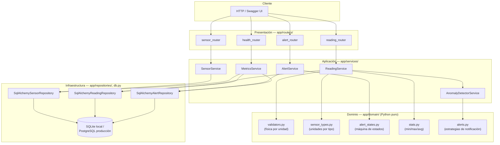
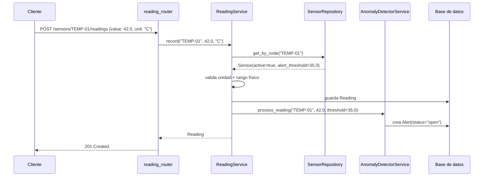

# 🛠️ SDLC Electrónica - Martín

<div align="center">
  
  
  
  
  <a href="https://github.com/martincb858/sdlc-electronica-martincb/actions/workflows/ci.yml">
    
  </a>
</div>

---

## 📝 Descripción del proyecto
Este repositorio reúne una serie de ejercicios y una API real para el desarrollo de software con enfoque en calidad, pruebas y buenas prácticas. El proyecto principal es una API REST con FastAPI para gestionar sensores IoT y sus lecturas, con validaciones de dominio y soporte para despliegue en Render.

---

## ✨ Funcionalidades principales
- Gestión de sensores: crear, listar, consultar, actualizar y desactivar
  (soft-delete: un sensor desactivado deja de aceptar lecturas nuevas, pero
  su histórico sigue consultable), con umbral de alerta configurable.
- Gestión de lecturas: ingesta con validación física por tipo de sensor,
  consulta paginada con filtro por rango de fechas.
- Detección de anomalías: una lectura que supera el umbral del sensor
  genera automáticamente una alerta.
- Gestión de alertas: consulta filtrable por estado y cambio de estado
  (`open -> acknowledged -> resolved`, validado como máquina de estados).
- Estadísticas por sensor y periodo: mínimo, máximo y promedio.
- Endpoint de salud (`/health`) y métricas básicas (`/metrics`).
- Logging estructurado en JSON y manejo global de errores.
- Configuración exclusivamente por variables de entorno.

---

## 🚀 Stack utilizado
- Python 3.10+
- FastAPI
- SQLAlchemy
- Pydantic
- Alembic
- Pytest
- Ruff
- Mypy

---

## 🏗️ Arquitectura

Cuatro capas, cada una conoce solo la inmediata inferior. Ver
[ADR-0001](docs/adr/0001-arquitectura-en-capas.md) y
[ADR-0002](docs/adr/0002-ciclo-de-vida-de-alertas.md) para el porqué.



**Flujo de una lectura con anomalía:**



---

## 🧱 Estructura del proyecto
- app/: aplicación FastAPI, routers, servicios, esquemas y modelo de base de datos.
- migrations/: migraciones de Alembic.
- tests/: pruebas de la API y de la lógica de negocio.
- semana1/, semana2/: ejercicios y prácticas de SDLC, diseño y testing.

---

## 🛠️ Instalación local

### 1. Clonar el repositorio
```bash
git clone https://github.com/martincb858/sdlc-electronica-martincb.git
cd sdlc-electronica-martincb
```

### 2. Crear y activar un entorno virtual
```bash
python -m venv .venv
source .venv/bin/activate
```

En Windows PowerShell:
```powershell
python -m venv .venv
.\.venv\Scripts\Activate.ps1
```

### 3. Instalar dependencias
```bash
pip install -r requirements.txt
```

---

## ▶️ Ejecutar la API localmente
```bash
uvicorn app.main:app --reload
```

La API quedará disponible en:
- http://127.0.0.1:8000/docs
- http://127.0.0.1:8000/health

---

## 🧪 Ejecutar pruebas
```bash
pytest
```

---

## 🌐 API desplegada en Render
La versión publicada actualmente está disponible en:

https://sensorhub-api-7bkq.onrender.com/

Endpoints útiles:
- /health
- /metrics
- /docs
- /sensors
- /sensors/{sensor_code}/readings
- /sensors/{sensor_code}/stats
- /sensors/{sensor_code}/alerts
- /alerts/{alert_id} (PATCH para cambiar estado)

---

## ⚙️ Variables de entorno

Toda la configuración es exclusivamente por variables de entorno, sin
archivos de config adicionales:

| Variable | Default local | Descripción |
|---|---|---|
| `DATABASE_URL` | `sqlite:///sensorhub.db` | Cadena de conexión. Acepta `postgres://`/`postgresql://` y los normaliza a `postgresql+psycopg://`. |
| `LOG_LEVEL` | `INFO` | Nivel de logging (`DEBUG`, `INFO`, `WARNING`, `ERROR`). Logs emitidos como JSON estructurado a stdout. |

---

## 🐳 Ejecutar con Docker
```bash
docker compose up --build
```

---

## 📌 Notas
El despliegue en Render está configurado con Alembic para aplicar migraciones automáticamente antes de iniciar la aplicación.
